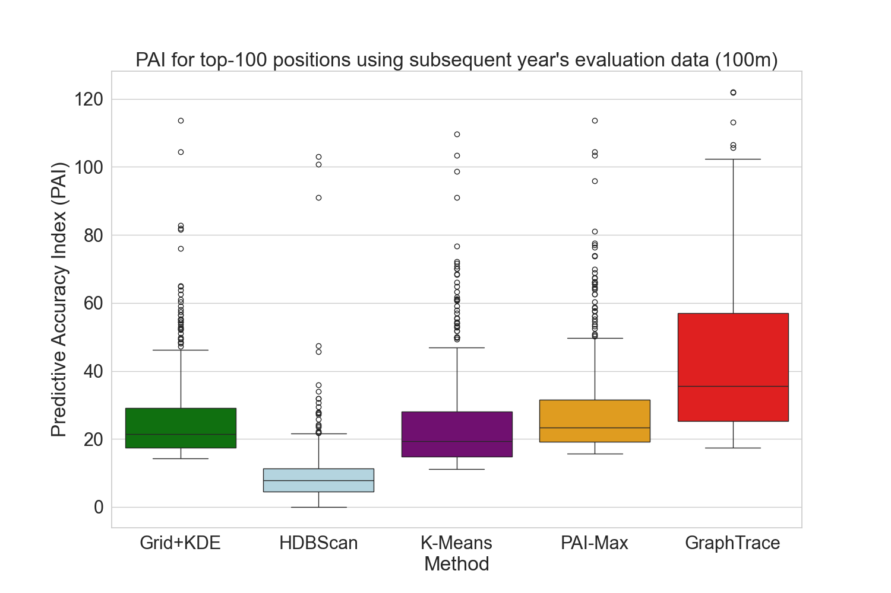

# *GraphTrace*: Crime Hotspot Detection Using Graph-Based Analysis

**GraphTrace** is a Python implementation of a crime hotspot detection algorithm that leverages spatial graph analysis. It identifies and ranks locations by crime intensity using graph theory and geospatial clustering techniques. By operating on *unique* latitude–longitude coordinates rather than every individual crime event, GraphTrace significantly reduces the computational complexity of crime mapping. This design delivers fast, scalable performance while maintaining accuracy, even for large-scale urban datasets.  
The example below shows a comparison of the Predictive Accuracy Index (PAI) for the top-100 positions detected by GraphTrace and several state-of-the-art methods, using official crime data from the city of Malmö, Sweden.



For full details, see the article *GraphTrace: A Graph-Guided Hotspot Detection Method for CCTV Placement* in the [*Journal of Quantitative Criminology*](https://doi.org/10.1007/s10940-025-09623-9).

---

## Overview

This project provides tools to:
- Preprocess crime incident data with geospatial attributes
- Construct spatial graph using proximity (BallTree)
- Detect and rank crime hotspots
- Evaluate spatial accuracy over future crime data

---

## Project Structure

```
.
├── GraphTrace.py              # Main entry point to run the hotspot detection pipeline
├── GraphTrace_functions.py    # Core logic: graph construction, hotspot ranking, evaluation
├── LICENSE 	               # MIT License (see below)
├── Data/                      # Input data directory (crime datasets as CSV)
│   └── Malmo_example_crime_data.csv # Example crime data (with random noise added)
└── Results/                   # Output directory (pickled graphs, results CSVs)
```

---

## Requirements

- Python 3.8+
- pandas
- geopandas
- networkx
- shapely
- scikit-learn
- haversine
- matplotlib
- geopy

Install via:

```bash
pip install -r requirements.txt
```

*Note: You may need to install system-level dependencies for `geopandas` and `shapely`.*

---

## Usage

```bash
python GraphTrace.py Data/Malmo_example_crime_data.csv
```

You can configure parameters in the GraphTrace.py, e.g.:
- The year(s) to analyze. Note: two years of data must always exist in the data file, one for finding hotspots and the next to evaluate them.
- Camera coverage radius, e.g., 50 or 100 meters.
- Graph spacing and thresholds.

Refer to comments in `GraphTrace.py` for parameter settings.

---

## Data input

The program takes one argument that should be the path to a CSV file containing the crime data to analyze. The columns in the CSV should be named:
- crime_code: integer values representing the type of crime. In the example crime data file it is set to a dummy value (99) for all crimes.
- year: integer values representing the year when the crime occurred, e.g., 2025. In the example data file it is set to 1 and 2
- latitude: floating point values representing latitude coordinates, e.g., 55.6050.
- longitude:floating point values representing longitude coordinates, e.g., 13.1075.

*Note: the crime data that is read must contain crime data for two consequtive years, e.g, 1 and 2, or 2023 and 2024. The first one is used for finding hotspot positions given that crime data, then these positions are evaluated against how many crimes are within the radius during the next year. If more than two years are included, e.g., [2022, 2023, 2024], then hotspots are detected using first the crimes in year 2022, and then for 2023. These positions are evaluated against the crime data in year 2023 and 2024, respectively.* 

---

## Disclaimer

This code is intended for research and educational purposes only. It is not intended for operational use or for real-time law enforcement decisions without independent validation and oversight. Use at your own risk.

---

## License

This project is licensed under the MIT License – see the [LICENSE](LICENSE) file for details.

## Citation

If you use GraphTrace in your work, please cite the following publication:

> Boldt, M., Lewenhagen, K., Borg, A., Kronkvist, K., & Gerell, M. (2025). *GraphTrace: A Graph-Guided Hotspot Detection Method for CCTV Placement*. *Journal of Quantitative Criminology*, 1-32. [https://doi.org/10.1007/s10940-025-09623-9](https://doi.org/10.1007/s10940-025-09623-9)

BibTeX:
```bibtex
@article{boldt2025graphtrace,
author = {Boldt, Martin and Lewenhagen, Kenneth and Borg, Anton and Kronkvist, Karl and Gerell, Manne},
doi = {10.1007/s10940-025-09623-9},
journal = {Journal of Quantitative Criminology},
month = jul,
title = {{GraphTrace: A Graph-Guided Hotspot Detection Method for CCTV Placement}},
pages = {1-32},
url = {https://link.springer.com/article/10.1007/s10940-025-09623-9},
year = {2025}
}
```

---